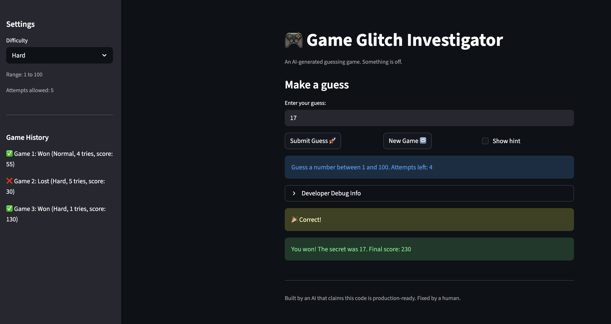
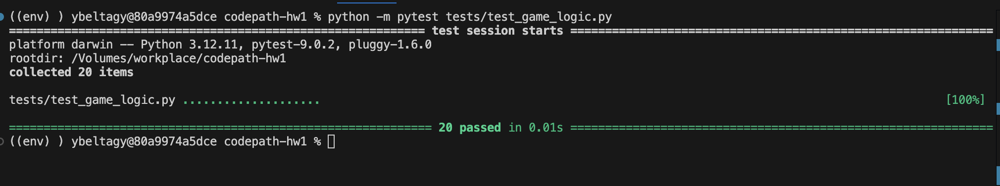

# 🎮 Game Glitch Investigator: The Impossible Guesser

## 🚨 The Situation

You asked an AI to build a simple "Number Guessing Game" using Streamlit.
It wrote the code, ran away, and now the game is unplayable. 

- You can't win.
- The hints lie to you.
- The secret number seems to have commitment issues.

## 🛠️ Setup

1. Install dependencies: `pip install -r requirements.txt`
2. Run the broken app: `python -m streamlit run app.py`

## 🕵️‍♂️ Your Mission

1. **Play the game.** Open the "Developer Debug Info" tab in the app to see the secret number. Try to win.
2. **Find the State Bug.** Why does the secret number change every time you click "Submit"? Ask ChatGPT: *"How do I keep a variable from resetting in Streamlit when I click a button?"*
3. **Fix the Logic.** The hints ("Higher/Lower") are wrong. Fix them.
4. **Refactor & Test.** - Move the logic into `logic_utils.py`.
   - Run `pytest` in your terminal.
   - Keep fixing until all tests pass!

## 📝 Document Your Experience

This is a number guessing game where the player guesses a secret number within a limited number of attempts, with difficulty settings that control the range and attempt limit, and a cumulative score based on how quickly the player guessed correctly.

There were some bugs in the game that I documented in `reflection.md` and fixed.

## 📸 Demo

## 🚀 Stretch Features

1. Added edge case tests
2. Added game history in the sidebar
   1. AI implemented almost all of the code. I reviewed, tested, and may have fixed it.
   2. I don't like how the implementation uses hardcoded strings all over the place... but... meh
3. Fixed obscure UI lag bug where attempt history and number of attempts were inaccurate
4. Fixed all bugs
5. Even if hints are disabled, the game tells the player if their answer was wrong

Edge case tests pass:

